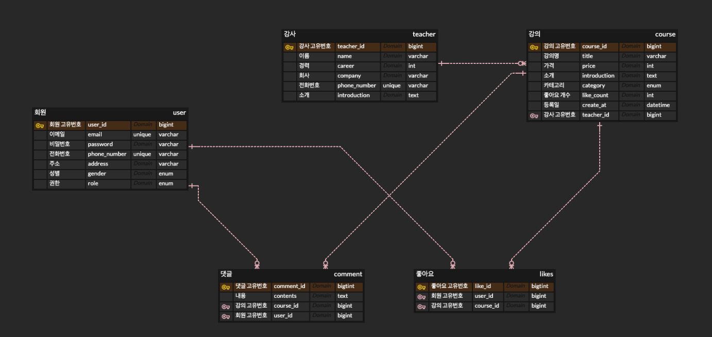

# 항해99 주특기 Lv.4 과제 - 강의 사이트 백엔드 REST API 

## 📝 개요
- 강의 사이트 REST API 개발 과제입니다.
---

### 🛠️ Stack
- IntelliJ IDEA Ultimate
- Gradle
- Spring Security
- Spring boot v3.2.3
- Spring MVC
- Spring Data JPA
- MySQL
- Java 17

### ERD - https://www.erdcloud.com/d/rNAWoXsGqnx2ohX2A

### Usecase Diagram

### API 명세서 (Postman)
- Postman API Document 입니다.
- https://documenter.getpostman.com/view/28420346/2sA2xiVBpM

---

## 💡주요 기능
- 회원(ADMIN, USER)
    - [x] 회원 가입
    - [x] 회원 로그인
- 강사
    - [x] 강사 등록 - ADMIN 권한만 가능
- 강의
    - [x] 강의 등록 - ADMIN 권한만 가능
    - [x] 선택한 강의 조회 - 강사 정보, 댓글 정보 함께 응답
    - [x] 카테고리별 강의 목록 조회 기능
- 댓글
    - [x] 선택한 강의 댓글
    - [x] 선택한 강의의 선택한 댓글 수정
    - [x] 선택한 강의의 선택한 댓글 삭제
- 좋아요
    - [x] 강의 좋아요
    - [x] 강의 좋아요 취소
